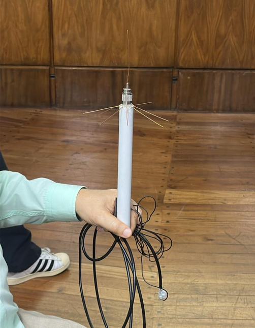
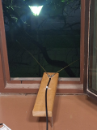

# Sintonización de señales con antenas caseras

## Antena paraguas: 
### La longitud de la antena es de 13cm, por lo que la longitud de onda es de 52cm, y por lo tanto la frecuencia a la que resuena es de 576.9231MHz

## Antena Dipolar: 
### La longitud de la antena es de 46cm, por lo que la longitud de onda es de 184cm, y por lo tanto la frecuencia a la que resuena es de 163.043MHz
